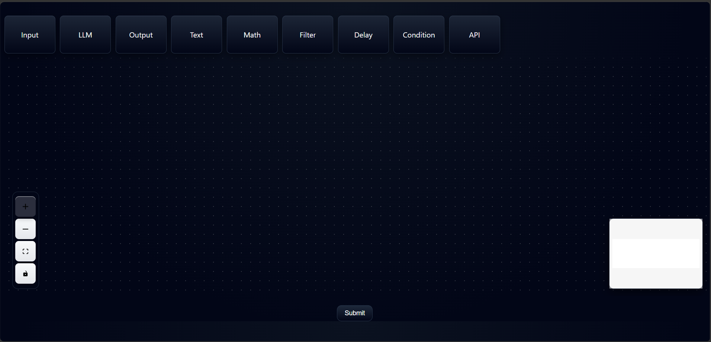
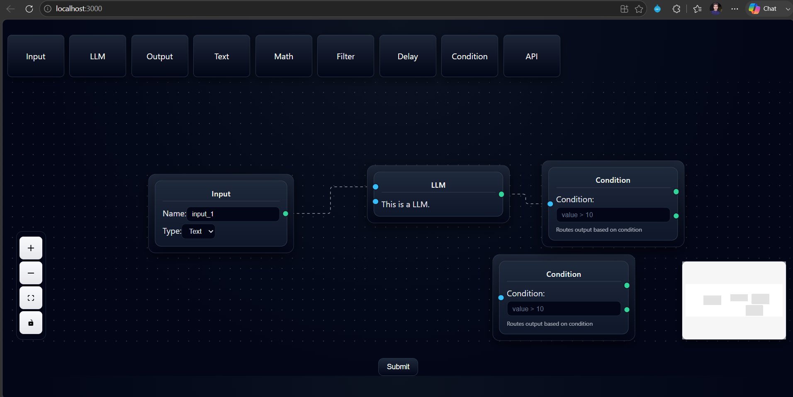

# Graphinity

### Visual Workflow & Pipeline Designer

Graphinity is a modern node-based visual workflow and pipeline designer that enables users to create, connect, configure, and validate workflows through an intuitive drag-and-drop interface. Built with React, React Flow, Zustand, and FastAPI, Graphinity demonstrates scalable frontend architecture, reusable component design, graph-based workflow visualization, and seamless frontend-backend integration.

---

## 🚀 Features

- Drag-and-drop visual workflow editor
- 9 customizable workflow node types
- Reusable BaseNode architecture for scalable node development
- Dynamic Text Node with:
  - Automatic resizing
  - Variable detection using `{{variable}}` syntax
  - Dynamic input handle generation
- Interactive node connections using React Flow
- Modern responsive dark UI
- Backend integration with FastAPI
- Workflow graph analysis
- Node count and edge count calculation
- Directed Acyclic Graph (DAG) validation
- Real-time pipeline submission and analysis

---

## 🏗️ Project Architecture

```
Graphinity
│
├── frontend
│   ├── public
│   ├── src
│   │   ├── nodes
│   │   ├── App.js
│   │   ├── ui.js
│   │   ├── toolbar.js
│   │   ├── draggableNode.js
│   │   ├── submit.js
│   │   └── store.js
│   │
│   └── package.json
│
└── backend
    ├── main.py
    └── requirements.txt
```

---

## 📌 Workflow Nodes

Graphinity currently includes the following workflow nodes:

- Input Node
- Output Node
- Text Node
- LLM Node
- Math Node
- Filter Node
- Delay Node
- Condition Node
- API Node

---

## 🛠️ Tech Stack

### Frontend

- React.js
- React Flow
- JavaScript (ES6+)
- Zustand
- HTML5
- CSS3

### Backend

- FastAPI
- Python
- Uvicorn

---

## ✨ Highlights

- 9 custom workflow nodes
- 15+ React components
- Reusable node abstraction
- Interactive drag-and-drop canvas
- Dynamic variable parsing
- Automatic input handle generation
- Graph validation using DAG detection
- Full-stack React + FastAPI architecture

---

## ⚙️ Installation

### Clone Repository

```bash
git clone https://github.com/YOUR_USERNAME/graphinity.git
cd graphinity
```

---

### Frontend

```bash
cd frontend
npm install
npm start
```

Frontend runs at:

```
http://localhost:3000
```

---

### Backend

```bash
cd backend
pip install -r requirements.txt
python -m uvicorn main:app --reload
```

Backend runs at:

```
http://127.0.0.1:8000
```

API Documentation:

```
http://127.0.0.1:8000/docs
```

---

## 📷 Preview




---

## 📈 Future Enhancements

- Workflow persistence
- Import / Export pipelines
- User authentication
- Pipeline templates
- Undo / Redo functionality
- Auto layout algorithms
- Workflow execution engine
- Cloud deployment
- Real-time collaboration
- Workflow version history

---

## 📄 License

This project is released under the MIT License.

---

## 👨‍💻 Author

**Dixant Soni**

B.Tech Computer Science & Engineering (AI & Data Science)

Indian Institute of Information Technology Senapati, Manipur

GitHub: https://github.com/DIXANTOFFICIAL1

---

⭐ If you found this project interesting, consider giving it a star!
