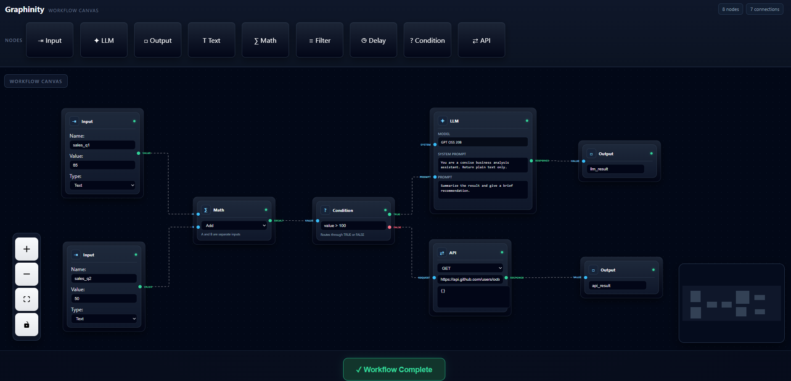
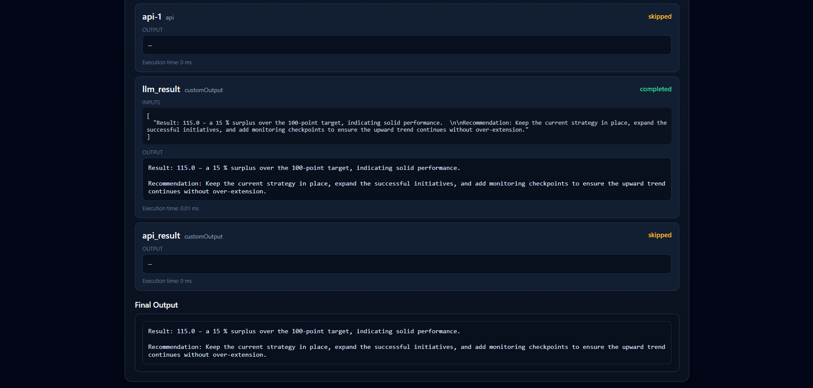
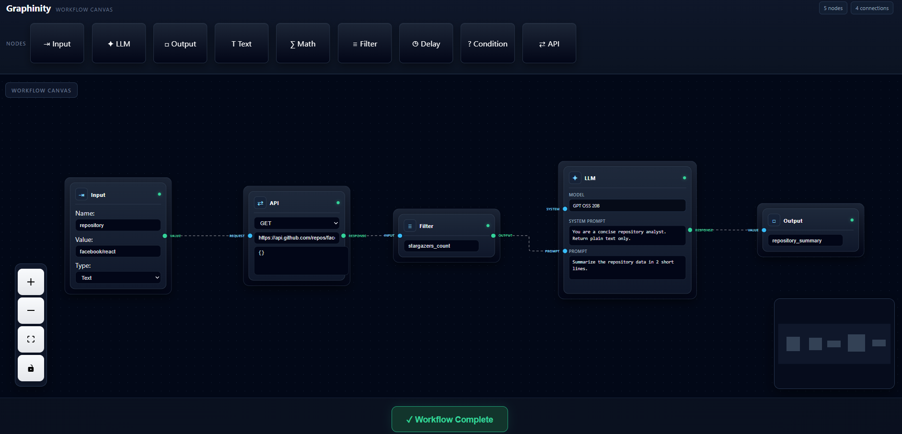
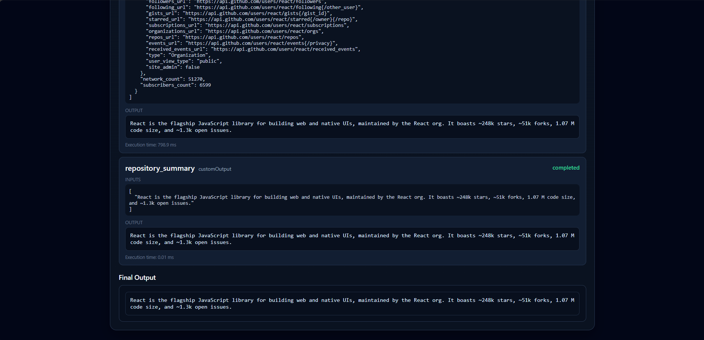

<div align="center">

# 🔷 Graphinity

### Visual AI Workflow Builder & Execution Engine

A full-stack platform for building, connecting, validating, and executing AI-powered workflows through a visual node-based editor.


</div>

---

# 📖 Overview

**Graphinity** is a visual workflow builder that lets users create AI and data workflows without writing the entire workflow as code.

Users can drag nodes onto a canvas, configure them, connect them, and execute the complete workflow.

The frontend is built with **React and React Flow**, while the backend uses **FastAPI, NetworkX, and a custom execution engine** to validate and execute workflow graphs.

Graphinity also supports **real LLM execution through the Groq API**, conditional branching, HTTP API requests, data processing nodes, and detailed execution monitoring.

---

# ✨ Features

- 🧩 Visual drag-and-drop workflow editor
- 🔗 Node-based connections
- 🧠 Directed Acyclic Graph (DAG) execution
- 🔍 Workflow validation and cycle detection
- 🤖 Real LLM execution using Groq
- 🔀 TRUE/FALSE conditional branching
- 🌐 HTTP API integration
- ➕ Math operations
- 📝 Text processing and variable resolution
- 🔎 Keyword-based filtering
- ⏱️ Delay node
- 📥 Input and 📤 Output nodes
- 📊 Execution monitoring
- 📋 Execution order tracking
- ⏱️ Node-level execution timing
- 🧾 Inputs and outputs for each executed node
- ❌ Delete nodes without refreshing
- 🔒 Canvas interaction lock
- 🗺️ Zoom, fit-view, and minimap controls

---

# 🏗️ Architecture

```text
                         User
                           │
                           ▼
                ┌──────────────────┐
                │ React Frontend   │
                │                  │
                │ React Flow       │
                │ Zustand          │
                └────────┬─────────┘
                         │
                         │ Workflow JSON
                         ▼
                ┌──────────────────┐
                │ FastAPI Backend  │
                │                  │
                │ Validation       │
                │ Graph Processing │
                │ Execution Engine │
                └────────┬─────────┘
                         │
              ┌──────────┼──────────┐
              │          │          │
              ▼          ▼          ▼
          NetworkX     Groq API   HTTP APIs
              │          │          │
              └──────────┼──────────┘
                         ▼
                 Execution Results
                         │
                         ▼
                Execution Monitor
```

### How it works

1. The user creates a workflow in the React Flow canvas.
2. The frontend sends the nodes, edges, configuration, and inputs to the backend.
3. FastAPI receives and validates the workflow.
4. NetworkX is used to work with the workflow graph and determine execution order.
5. The execution engine processes nodes according to their dependencies.
6. Conditions determine which workflow branch continues.
7. LLM and API nodes communicate with external services when required.
8. Execution logs and results are returned to the frontend.
9. The Execution Monitor displays the workflow result.

---

# 🧩 Workflow Nodes

Graphinity currently supports:

| Node | Purpose |
|------|---------|
| **Input** | Provides workflow input values |
| **LLM** | Generates AI responses using Groq |
| **Output** | Produces the final workflow output |
| **Text** | Processes text and variables |
| **Math** | Performs arithmetic operations |
| **Filter** | Filters values using a keyword |
| **Delay** | Delays workflow execution |
| **Condition** | Routes execution through TRUE/FALSE branches |
| **API** | Sends HTTP requests and returns responses |

---

# 🔀 Conditional Workflows

Graphinity supports handle-aware conditional routing.

Example:

```text
                  ┌──── TRUE ─────► LLM ───► Output
                  │
Input ───► Condition
                  │
                  └──── FALSE ────► Output
```

For example:

```text
Condition
value > 10
```

The execution engine evaluates the condition and follows the corresponding TRUE or FALSE connection.

Nodes belonging to an inactive branch can be marked as **skipped** in the execution results.

---

# 🤖 LLM Integration

Graphinity can execute real LLM requests through the **Groq API**.

An LLM node supports:

- Model configuration
- System prompt
- User prompt
- Workflow input
- Downstream response propagation

Example:

```text
Input
  │
  ▼
LLM
  │
  ▼
Output
```

This allows Graphinity to combine visual workflow logic with real AI processing.

---

# 🌐 API Integration

The API node allows a workflow to communicate with external HTTP services.

Supported methods:

```text
GET
POST
PUT
DELETE
PATCH
```

Example:

```text
Input
  │
  ▼
API
  │
  ▼
Output
```

The node can be configured with a URL, request method, headers, and workflow input.

The API response is passed to downstream nodes.

---

# 📊 Execution Monitor

After a workflow is executed, Graphinity provides an execution monitor containing:

- Workflow status
- Number of executed nodes
- Number of skipped nodes
- Total execution duration
- Execution order
- Node inputs
- Node outputs
- Node status
- Node execution time
- Condition results
- Selected branch
- Error information

Example:

```text
Execution Monitor

Status: Completed

Execution Order

Input → LLM → Output

Node Results

Input
Output: What is AI?

LLM
Output: AI generated response...

Output
Final Output: AI generated response...
```

This makes it possible to inspect **how the workflow executed**, rather than only seeing the final result.

---

# 🛠️ Tech Stack

## Frontend

- React
- React Flow
- Zustand
- JavaScript
- React Markdown
- remark-gfm

## Backend

- Python
- FastAPI
- Uvicorn
- Pydantic
- Requests

## Workflow Engine

- NetworkX
- DAG execution
- Dependency-based node execution
- Conditional routing

## AI

- Groq API
- Groq Python SDK
- GPT OSS 20B

---

# 📂 Project Structure

```text
Graphinity/
│
├── assets/
│   └── images/
│       ├── workflow.png
│       ├── execution1.png
│       ├── api-workflow.png
│       └── execution2.png
│
├── backend/
│   ├── api/
│   │   ├── __init__.py
│   │   ├── execution_routes.py
│   │   └── pipeline_routes.py
│   │
│   ├── models/
│   │   ├── __init__.py
│   │   └── workflow.py
│   │
│   ├── services/
│   │   ├── __init__.py
│   │   ├── execution_service.py
│   │   ├── graph_service.py
│   │   └── validation_service.py
│   │
│   ├── main.py
│   └── requirements.txt
│
├── frontend/
│   ├── src/
│   │   ├── components/
│   │   │   └── ExecutionPanel.js
│   │   │
│   │   ├── nodes/
│   │   │   ├── BaseNode.js
│   │   │   ├── apiNode.js
│   │   │   ├── conditionNode.js
│   │   │   ├── delayNode.js
│   │   │   ├── filterNode.js
│   │   │   ├── inputNode.js
│   │   │   ├── llmNode.js
│   │   │   ├── mathNode.js
│   │   │   ├── outputNode.js
│   │   │   └── textNode.js
│   │   │
│   │   ├── App.js
│   │   ├── draggableNode.js
│   │   ├── store.js
│   │   ├── submit.js
│   │   ├── toolbar.js
│   │   ├── ui.js
│   │   └── useNodeField.js
│   │
│   ├── package.json
│   └── package-lock.json
│
├── .gitignore
└── README.md
```
---

# 🌐 Live Demo

**Frontend:** https://graphinity-1.vercel.app

**Backend:** https://graphinity.onrender.com

---

# ⚙️ Setup

## 1. Clone the Repository

```bash
git clone https://github.com/DIXANTOFFICIAL1/Graphinity.git
cd Graphinity
```

## 2. Environment Variables

Create:

```text
backend/.env
```

Add your Groq API key:

```env
GROQ_API_KEY=your_groq_api_key
```

> Never commit your `.env` file or expose your API key publicly.

---

# 💻 Usage

1. Open the [Graphinity Live Demo](https://graphinity-1.vercel.app).
2. Drag nodes from the toolbar onto the canvas.
3. Configure the node fields.
4. Connect nodes together.
5. Click **Run Workflow**.
6. Inspect execution status, node results, timing, and final output in the **Execution Monitor**.

### Example Workflow

```text
Input → Math → Condition → LLM/API → Output
```

### API Workflow

```text
Input → API → Filter → LLM → Output
```

### Example

```text
Input → LLM → Output
```

Or:

```text
Input → Condition
              │
        ┌─────┴─────┐
        ▼           ▼
      TRUE        FALSE
        │           │
       LLM        Output
        │
        ▼
      Output
```

---

# 📸 Screenshots

## Main Workflow



### Execution Result



## API & AI Workflow



### Execution Result



---

# 🔮 Future Scope

- Save and load workflows
- Workflow templates
- Execution history
- Additional LLM providers
- Parallel workflow execution
- User authentication
- Cloud deployment

---

# 👨‍💻 Author

**Dixant Soni**

- 🎓 B.Tech CSE (AI & Data Science)
- Indian Institute of Information Technology Manipur
- Passionate about Software Engineering, Artificial Intelligence, and Full-Stack Development

### GitHub

https://github.com/DIXANTOFFICIAL1

---

<div align="center">

### ⭐ If you like Graphinity, consider giving the repository a star!

**Build. Connect. Execute. 🚀**

</div>
